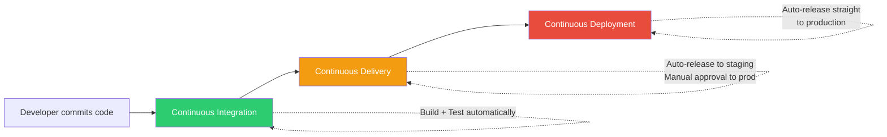
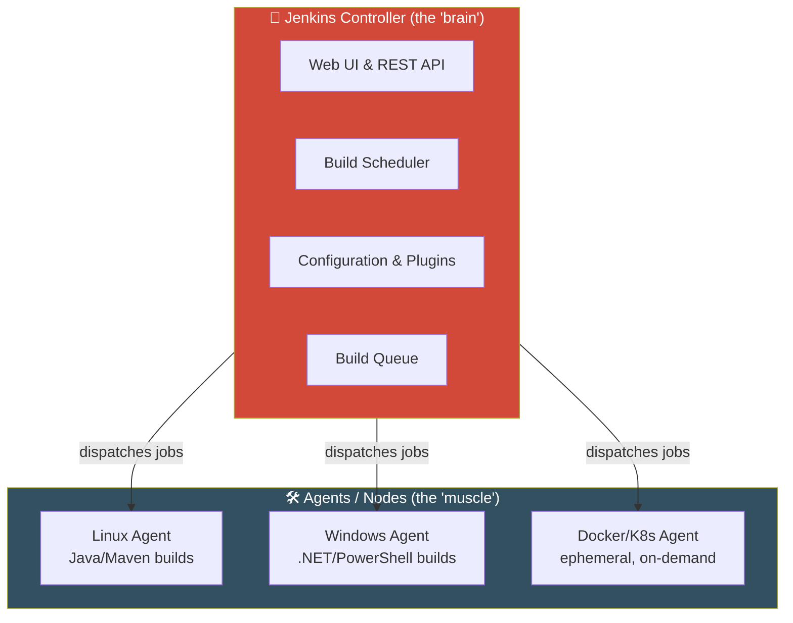
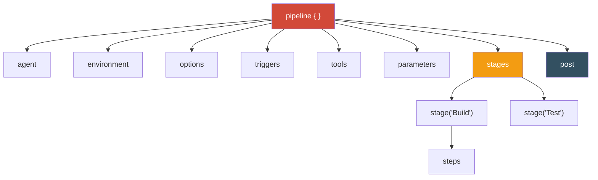
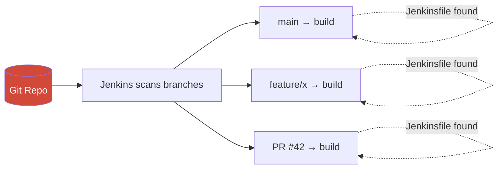
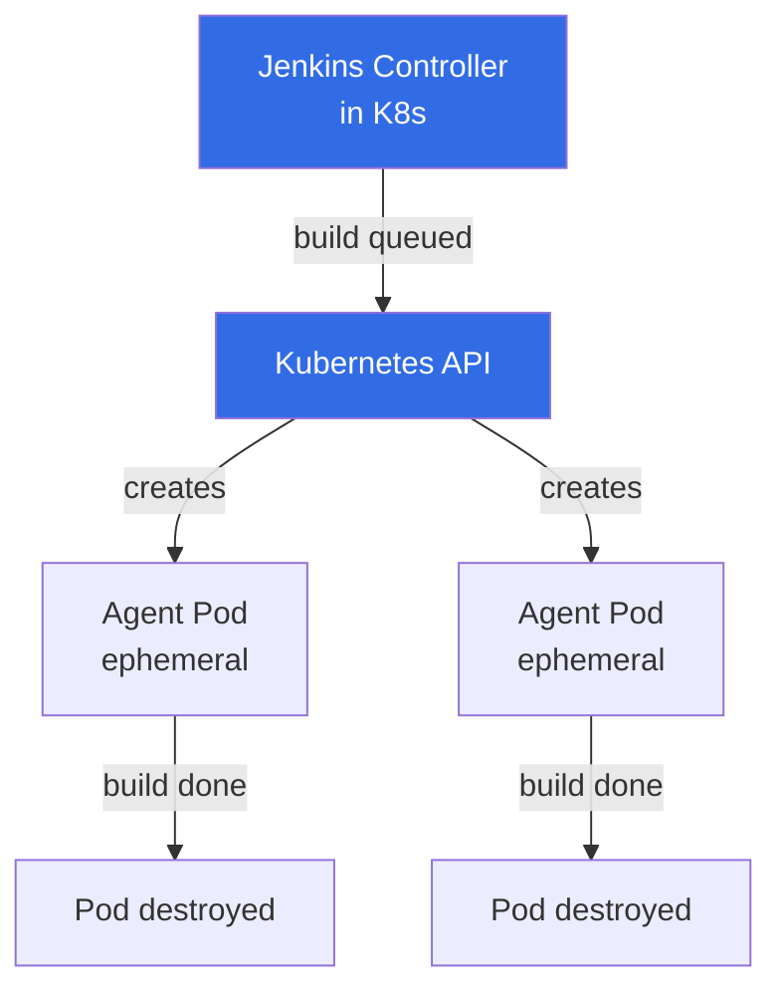

<div align="center">

# 🚀 Jenkins — The Complete Practical Guide

### From Zero to Enterprise CI/CD — Basic → Intermediate → Advanced

*A structured, hands-on reference covering installation, pipelines, Docker, Kubernetes, security, and Configuration as Code.*


</div>

---

> [!NOTE]
> **Reference version.** This guide targets **Jenkins LTS 2.555.x** (the current LTS line as of mid‑2026), which requires **Java 21 or Java 25**. Java 17 and older are no longer supported on the LTS line. Concepts, pipeline syntax, and workflows here apply to any modern Jenkins 2.x release.

---

## 📖 How to Use This Guide

This guide is organized into **three progressive levels**. Each concept builds on the previous one, and every section includes **copy‑paste‑ready commands and code**. Work top to bottom if you're new, or jump straight to a topic using the Table of Contents.

| Symbol | Meaning |
| :---: | :--- |
| 🟢 | **Basic** — foundations, installation, first jobs |
| 🟡 | **Intermediate** — pipelines as code, automation, quality gates |
| 🔴 | **Advanced** — scaling, cloud, security, enterprise operations |
| 💻 | Runnable command or code you can use directly |
| 💡 | Best‑practice tip or real‑world insight |
| ⚠️ | Common pitfall to avoid |

---

## 🗂️ Table of Contents

<details>
<summary><b>Click to expand the full curriculum</b></summary>

### 🟢 Basic Level — Foundations & Setup
1. [Introduction to DevOps & CI/CD](#1-introduction-to-devops--cicd)
2. [Jenkins Architecture](#2-jenkins-architecture)
3. [Installation & Configuration](#3-installation--configuration)
4. [The Dashboard & Views](#4-the-dashboard--views)
5. [Plugin Management](#5-plugin-management)
6. [Freestyle Projects](#6-freestyle-projects)
7. [Basic User Management & Security](#7-basic-user-management--security)

### 🟡 Intermediate Level — Pipelines & Automation
8. [Build Tools Integration](#8-build-tools-integration)
9. [Introduction to Pipelines](#9-introduction-to-pipelines)
10. [Declarative vs. Scripted Pipelines](#10-declarative-vs-scripted-pipelines)
11. [Pipeline Syntax Deep Dive](#11-pipeline-syntax-deep-dive)
12. [Build Triggers & Webhooks](#12-build-triggers--webhooks)
13. [Code Quality & Testing](#13-code-quality--testing)
14. [Notifications](#14-notifications)

### 🔴 Advanced Level — Scaling, Enterprise & Cloud
15. [Multibranch Pipelines](#15-multibranch-pipelines)
16. [Jenkins Shared Libraries](#16-jenkins-shared-libraries)
17. [Docker Integration](#17-docker-integration)
18. [Kubernetes Integration](#18-kubernetes-integration)
19. [Security & Credentials Management](#19-security--credentials-management)
20. [Configuration as Code (JCasC)](#20-configuration-as-code-jcasc)
21. [Administration & Maintenance](#21-administration--maintenance)

### 📎 Appendices
- [A. Jenkinsfile Cheat Sheet](#appendix-a--jenkinsfile-cheat-sheet)
- [B. Essential Plugins Reference](#appendix-b--essential-plugins-reference)
- [C. Glossary](#appendix-c--glossary)
- [D. Further Learning](#appendix-d--further-learning)

</details>

---
---

# 🟢 BASIC LEVEL — Foundations & Setup

---

## 1. Introduction to DevOps & CI/CD

**DevOps** is a culture and set of practices that unites software development (**Dev**) and IT operations (**Ops**) to shorten the delivery lifecycle and deliver software continuously and reliably. Jenkins is one of the most widely used **automation servers** for putting DevOps into practice.

At the heart of DevOps sits the **CI/CD pipeline**. The three terms are often confused, so here is the precise distinction:



| Concept | What it means | Human approval? |
| :--- | :--- | :---: |
| **Continuous Integration (CI)** | Developers merge code into a shared branch frequently. Every commit automatically triggers a **build** and **automated tests** to catch integration problems early. | N/A |
| **Continuous Delivery (CD)** | Every change that passes CI is automatically prepared and **released to a staging/pre‑prod environment**. Deployment to *production* is a **manual, one‑click decision**. | ✅ Yes (to prod) |
| **Continuous Deployment (CD)** | Goes one step further — every change that passes all automated tests is **deployed straight to production** with **no human intervention**. | ❌ No |

> 💡 **The mental model:** *Continuous Delivery* means you are **always able** to deploy. *Continuous Deployment* means you **always do** deploy.

**Why Jenkins?**
- Open‑source and free, with a massive **1,800+ plugin** ecosystem.
- **Pipeline as Code** — your entire build/test/deploy process lives in a versioned `Jenkinsfile`.
- Platform‑agnostic — runs on Linux, Windows, macOS, Docker, and Kubernetes.
- Integrates with virtually every tool: Git, Maven, Gradle, Docker, SonarQube, Slack, AWS, Azure, and more.

---

## 2. Jenkins Architecture

Jenkins uses a **distributed controller/agent** architecture (formerly called *master/slave* — the modern, inclusive terminology is **controller** and **agent/node**).



| Component | Role |
| :--- | :--- |
| **Controller** | The central coordinator. Serves the web UI, stores configuration, schedules builds, and dispatches work. It **should not** run heavy builds itself in production. |
| **Agent (Node)** | A worker machine (physical, VM, container) that connects to the controller and **executes** the actual build/test/deploy work. |
| **Executor** | A single "slot" for running one build on an agent. An agent with 4 executors can run 4 builds in parallel. |
| **Job / Project** | A configurable, runnable task (Freestyle, Pipeline, Multibranch, etc.). |
| **Build** | A single execution (run) of a job, with a unique number (#1, #2, …). |

> 💡 **Production best practice:** Keep the controller lightweight — set its executor count to **0** and run all workloads on dedicated agents. This protects the controller and improves security and stability.

**How agents connect to the controller:**
- **SSH** — controller launches the agent over SSH (great for Linux).
- **Inbound (JNLP / WebSocket)** — agent initiates the connection to the controller (great for machines behind firewalls / cloud).
- **Cloud plugins** — Docker and Kubernetes plugins spin up **ephemeral agents on demand** and destroy them after the build (covered in the Advanced section).

---

## 3. Installation & Configuration

There are several ways to install Jenkins. Pick the one that matches your goal.

### 💻 Option A — Docker (fastest, recommended for learning)

```bash
# Create a persistent volume so your config survives container restarts
docker volume create jenkins_home

# Run the official LTS image
docker run -d \
  --name jenkins \
  -p 8080:8080 \
  -p 50000:50000 \
  -v jenkins_home:/var/jenkins_home \
  --restart unless-stopped \
  jenkins/jenkins:lts-jdk21
```

- Port **8080** → the web UI.
- Port **50000** → inbound agent connections.
- Data lives in the `jenkins_home` volume.

### 💻 Option B — Linux (Debian/Ubuntu, production style)

```bash
# 1. Install Java 21 (required by current LTS)
sudo apt update
sudo apt install -y fontconfig openjdk-21-jre

# 2. Add the Jenkins repository key and source
sudo wget -O /usr/share/keyrings/jenkins-keyring.asc \
  https://pkg.jenkins.io/debian-stable/jenkins.io-2023.key

echo "deb [signed-by=/usr/share/keyrings/jenkins-keyring.asc] \
  https://pkg.jenkins.io/debian-stable binary/" | \
  sudo tee /etc/apt/sources.list.d/jenkins.list > /dev/null

# 3. Install Jenkins
sudo apt update
sudo apt install -y jenkins

# 4. Start and enable the service
sudo systemctl enable --now jenkins
sudo systemctl status jenkins
```

### 💻 Option C — Linux (RHEL / Amazon Linux / Rocky)

```bash
sudo wget -O /etc/yum.repos.d/jenkins.repo \
  https://pkg.jenkins.io/redhat-stable/jenkins.repo
sudo rpm --import https://pkg.jenkins.io/redhat-stable/jenkins.io-2023.key

sudo dnf install -y fontconfig java-21-openjdk jenkins
sudo systemctl enable --now jenkins
```

### 🔓 Unlocking Jenkins & the Setup Wizard

1. Open `http://<server-ip>:8080` in your browser.
2. Jenkins asks for the **initial admin password**. Retrieve it:

   ```bash
   # Linux package install
   sudo cat /var/lib/jenkins/secrets/initialAdminPassword

   # Docker install
   docker exec jenkins cat /var/jenkins_home/secrets/initialAdminPassword
   ```
3. Choose **"Install suggested plugins"** (recommended for first‑timers).
4. Create your **first admin user** (do **not** keep using the temporary admin).
5. Confirm the **Jenkins URL** and click *Save and Finish*. 🎉

> ⚠️ **Firewall reminder:** On cloud VMs (AWS/Azure), open inbound port **8080** in the security group, or you won't reach the UI.

---

## 4. The Dashboard & Views

The **dashboard** is your Jenkins home screen. Key areas:

| Area | Purpose |
| :--- | :--- |
| **New Item** | Create a new job (Freestyle, Pipeline, Multibranch, Folder…). |
| **Build Executor Status** | Live view of which agents/executors are busy. |
| **Build Queue** | Jobs waiting for a free executor. |
| **Manage Jenkins** | The admin control panel (plugins, security, nodes, system config). |
| **Weather / Health icons** | ☀️ → recent builds passing; ⛅/🌧️ → increasing failure rate. |

### Organizing with Views

As the number of jobs grows, the flat list becomes unmanageable. **Views** are custom tabs that filter and group jobs.

**To create a view:** Dashboard → click the **+** tab → choose a type:
- **List View** — pick jobs manually or by a **regex** on the job name (e.g., `payments-.*`).
- **My View** — automatically shows only jobs you have access to.

> 💡 Combine **Folders** (from the *Folders* plugin) with views to build a clean hierarchy like `Team A / Frontend / build-pipeline`. Folders also allow **scoped credentials** and permissions.

---

## 5. Plugin Management

Plugins are what make Jenkins infinitely extensible. Almost every integration — Git, Docker, Slack, SonarQube — is a plugin.

**Navigate to:** `Manage Jenkins → Plugins`

| Tab | Use |
| :--- | :--- |
| **Available plugins** | Browse/search and install new plugins. |
| **Installed plugins** | View, enable/disable, or uninstall existing plugins. |
| **Updates** | Keep plugins patched (important for **security**). |

### 💻 Essential starter plugins

| Plugin | Why you need it |
| :--- | :--- |
| **Git** | Clone and integrate with Git repositories. |
| **Pipeline** (Pipeline: Groovy, Stage View) | Enables `Jenkinsfile` pipelines. |
| **Docker Pipeline** | Build/run Docker inside pipelines. |
| **Credentials Binding** | Inject secrets safely into builds. |
| **Blue Ocean** | A modern, visual pipeline UI. |
| **Maven / Gradle / NodeJS** | Managed build‑tool installations. |
| **Email Extension** | Rich build notifications. |

> ⚠️ **Golden rule:** Always update plugins **before and after** upgrading Jenkins core, and restart when prompted. Mismatched plugin/core versions are the #1 cause of broken Jenkins instances.

> 💡 For reproducible infrastructure, manage plugins as a versioned list with a `plugins.txt` file and the `jenkins-plugin-cli` tool rather than clicking in the UI (see [JCasC](#20-configuration-as-code-jcasc)).

---

## 6. Freestyle Projects

A **Freestyle project** is the classic, UI‑configured job. It's the simplest way to understand Jenkins before moving to pipelines.

### 💻 Creating your first Freestyle job

1. **New Item** → enter a name → select **Freestyle project** → **OK**.
2. **Source Code Management** → select **Git**:
   - Repository URL: `https://github.com/your-org/your-repo.git`
   - Credentials: add username/token if the repo is private.
   - Branch: `*/main`
3. **Build Triggers** → e.g. *Poll SCM* or *GitHub hook trigger* (see [Section 12](#12-build-triggers--webhooks)).
4. **Build Steps** → *Execute shell* (Linux/macOS) or *Execute Windows batch command*:

   ```bash
   # Execute shell example
   echo "Building commit $GIT_COMMIT"
   mvn clean package
   ```

   ```bat
   REM Execute Windows batch command example
   echo Building on Windows
   mvn clean package
   ```
5. **Post-build Actions** → archive artifacts, publish test results, send emails.
6. **Save** → **Build Now**.

> 💡 **When to move on:** Freestyle jobs are fine for simple, one‑off tasks. But because their config lives only in the UI (not in version control) and can't easily express complex branching logic, real projects graduate to **Pipelines** ([Section 9](#9-introduction-to-pipelines)).

---

## 7. Basic User Management & Security

By default the setup wizard configures **Jenkins' own user database**. You manage the basics under `Manage Jenkins → Security`.

### Security Realm (who can log in)

- **Jenkins' own user database** — create local users directly in Jenkins.
- (Later) LDAP / Active Directory / SSO — covered in the [Advanced security section](#19-security--credentials-management).

**Create a local user:** `Manage Jenkins → Users → Create User`.

### Authorization (what users can do)

| Strategy | Description |
| :--- | :--- |
| **Logged‑in users can do anything** | Simple, but not safe for teams. |
| **Matrix‑based security** | A grid of **users × permissions** — precise control over who can build, configure, administer, etc. |
| **Project‑based Matrix** | Matrix permissions that can also be set **per job**. |

### 💻 Configuring Matrix‑based security

1. `Manage Jenkins → Security`.
2. Under **Authorization**, choose **Matrix‑based security**.
3. Add users/groups as rows; tick the permissions they need across the columns (Overall, Job, Run, Agent, etc.).

> ⚠️ **Never remove your own Administer permission before saving** — you can lock yourself out. If that happens, you can disable security by editing `config.xml` in `$JENKINS_HOME` and restarting.

> 💡 Grant the **minimum permissions necessary** (principle of least privilege). For larger orgs, the **Role‑based Authorization Strategy** plugin (Advanced) scales far better than a raw matrix.

---
---

# 🟡 INTERMEDIATE LEVEL — Pipelines & Automation

---

## 8. Build Tools Integration

Jenkins doesn't compile code itself — it **orchestrates build tools** like Maven, Gradle, and npm. You register these tools once, then reference them from any job.

**Register tools at:** `Manage Jenkins → Tools`

| Tool | Configure | Use in a build |
| :--- | :--- | :--- |
| **Maven** | Name it (e.g. `Maven-3.9`) → auto‑install from Apache. | `mvn clean package` |
| **Gradle** | Name it (e.g. `Gradle-8`) → auto‑install. | `./gradlew build` |
| **NodeJS** | Requires the *NodeJS* plugin → name it (e.g. `Node-20`). | `npm ci && npm run build` |
| **JDK** | Name it (e.g. `JDK-21`) → auto‑install or point to a path. | Sets `JAVA_HOME`. |

> 💡 **Auto‑installers** let each job pick the exact tool version it needs — you can run legacy and modern projects on the same controller.

### 💻 Referencing a registered tool in a pipeline

```groovy
pipeline {
    agent any
    tools {
        maven 'Maven-3.9'   // must match the name in Manage Jenkins → Tools
        jdk   'JDK-21'
    }
    stages {
        stage('Build') {
            steps {
                sh 'mvn -version'
                sh 'mvn clean package'
            }
        }
    }
}
```

---

## 9. Introduction to Pipelines

A **Jenkins Pipeline** is a suite of plugins that lets you define your **entire** CI/CD workflow **as code** in a text file called a **`Jenkinsfile`**, checked into your source repository alongside your application.

**Why pipelines beat Freestyle jobs:**

| Freestyle | Pipeline |
| :--- | :--- |
| Config trapped in the UI | Config lives in a **versioned `Jenkinsfile`** |
| Hard to review or audit | **Code‑reviewable** via pull requests |
| Difficult branching logic | Full programmatic control (loops, conditions, parallelism) |
| One job = one process | A single source of truth, reusable across branches |
| Fragile — lost if server dies | Recreatable from source control |

> 💡 **Key benefits (from the fundamentals):** you can auto‑create pipelines for **every branch and pull request** with one `Jenkinsfile`, **review** the pipeline as code, **audit** its history, and survive a Jenkins rebuild because the pipeline is a durable, single source that can be reconstructed at any time.

There are **two syntaxes** for writing a `Jenkinsfile`:
1. **Declarative** — structured, opinionated, easier (recommended for 95% of cases).
2. **Scripted** — full Groovy programming power, more flexible, more complex.

---

## 10. Declarative vs. Scripted Pipelines

Both run on the same underlying engine, but they differ in structure and strictness.

### Declarative Pipeline

Declarative syntax offers an **easy, structured way** to create pipelines. It contains a **predefined hierarchy** and gives you the ability to control **all aspects** of pipeline execution in a simple, straightforward manner. Every valid Declarative pipeline **must be enclosed in a `pipeline { }` block**.

```groovy
pipeline {
    agent any
    stages {
        stage('Build') {
            steps {
                echo 'Building...'
            }
        }
    }
}
```

### Scripted Pipeline

A Scripted pipeline is a **sequence of stages** to perform CI/CD‑related tasks, specified **as code**. It's effectively a Groovy program, giving you maximum flexibility. It's enclosed in a `node { }` block.

```groovy
node {
    stage('Build') {
        echo 'Building...'
    }
    stage('Test') {
        echo 'Testing...'
    }
}
```

### Side‑by‑side

| Aspect | **Declarative** | **Scripted** |
| :--- | :--- | :--- |
| Wrapper block | `pipeline { }` | `node { }` |
| Structure | Rigid, predefined | Free‑form Groovy |
| Learning curve | Easy | Steep |
| Error checking | Validated up front | Fails at runtime |
| Flexibility | Good (with `script { }` escape hatch) | Unlimited |
| Recommended for | **Almost everything** | Complex, dynamic logic |

> 💡 You can drop into Groovy inside a Declarative pipeline using a `script { }` block — so you rarely need full Scripted pipelines.

---

## 11. Pipeline Syntax Deep Dive

This is the core of writing effective `Jenkinsfile`s. A valid Declarative pipeline **must** contain these required sections, and may include several optional **directives**.



### 🔹 `agent` — where the pipeline runs

The **agent** directive specifies **where** the entire pipeline, or a specific stage, will execute. It **must** be defined at the **top level** inside the `pipeline` block; defining it at the stage level is optional (and overrides the top‑level agent for that stage).

```groovy
pipeline {
    agent any          // run on any available agent
    // agent none       // no global agent; each stage must define its own
    // agent { label 'linux' }   // run only on agents labeled 'linux'
    // agent { docker { image 'maven:3.9-eclipse-temurin-21' } }  // run inside a container
    stages { /* ... */ }
}
```

### 🔹 `stages` and `stage` — the work segments

The **`stages`** section contains one or more **`stage`** blocks. Each stage is **visualized as a distinct segment** in the Jenkins UI when the job runs, so name them meaningfully. **At least one `stage` is required.**

```groovy
pipeline {
    agent any
    stages {
        stage('Build')  { steps { echo 'Compiling...'  } }
        stage('Test')   { steps { echo 'Testing...'    } }
        stage('Deploy') { steps { echo 'Deploying...'  } }
    }
}
```

### 🔹 `steps` — the actual commands

The **`steps`** section is defined inside a `stage` and holds the commands that do the work. **At least one step is required** per stage.

```groovy
stage('Build') {
    steps {
        // Linux & macOS use 'sh'
        sh '''
            echo "one-line step"
            cd /opt/app
            ls -lrt
        '''
    }
}
```

For **Windows**, use `bat` or `powershell` instead of `sh`:

```groovy
stage('Build on Windows') {
    steps {
        bat 'mvn clean deploy'
        powershell '.\\test.ps1'
    }
}
```

### 🔹 `environment` — variables

Defines environment variables at the **pipeline** level (available everywhere) or **stage** level (scoped to that stage).

```groovy
pipeline {
    agent any
    environment {
        APP_ENV   = 'staging'
        REGISTRY  = 'registry.example.com'
        // Bind a secret from the Credentials store
        API_TOKEN = credentials('my-api-token')
    }
    stages {
        stage('Deploy') {
            environment { RETRIES = '3' }   // stage-scoped
            steps { sh 'echo Deploying to $APP_ENV with $RETRIES retries' }
        }
    }
}
```

### 🔹 `parameters` — user input at launch

Prompt for values when the pipeline starts (turns the job into "Build with Parameters").

```groovy
pipeline {
    agent any
    parameters {
        string(name: 'VERSION', defaultValue: '1.0.0', description: 'Release version')
        choice(name: 'ENVIRONMENT', choices: ['dev', 'staging', 'prod'], description: 'Target env')
        booleanParam(name: 'RUN_TESTS', defaultValue: true, description: 'Run the test suite?')
    }
    stages {
        stage('Deploy') {
            steps { echo "Deploying ${params.VERSION} to ${params.ENVIRONMENT}" }
        }
    }
}
```

### 🔹 `input` — pause for approval

Defined at the **stage** level, pauses the pipeline for human approval — perfect for gating production deploys.

```groovy
stage('Approve Production Deploy') {
    input {
        message "Deploy to PRODUCTION?"
        ok "Deploy"
        submitter "release-managers"
    }
    steps { sh './deploy-prod.sh' }
}
```

### 🔹 `tools` — auto‑install build tools

The **`tools`** directive can be added at the **pipeline** level or the **stage** level. It lets you specify which Maven, JDK, or Gradle version to use; Jenkins will **auto‑install** the listed tool if it isn't present. Any tool used **must** first be configured under `Manage Jenkins → Tools` (*Global Tool Configuration*).

```groovy
pipeline {
    agent any
    tools {
        maven  'Maven-3.9.3'
        jdk    'JDK-21'
        gradle 'Gradle-8.4'
    }
    stages { /* ... */ }
}
```

### 🔹 `options` — pipeline behavior

The **`options`** directive groups configuration for the whole pipeline (at pipeline level) or a stage (at stage level). Common available options:

| Option | Effect |
| :--- | :--- |
| `buildDiscarder` | Keep only the last *N* builds to save disk space. |
| `disableConcurrentBuilds` | Prevent overlapping runs of the same pipeline. |
| `timestamps` | Prepend timestamps to console output. |
| `timeout` | Abort the build after a time limit. |
| `retry` | Retry the whole pipeline *N* times on failure. |
| `skipDefaultCheckout` | Skip the automatic SCM checkout. |
| `skipStagesAfterUnstable` | Stop running stages once the build is UNSTABLE. |
| `checkoutToSubdirectory` | Check code out into a subfolder. |
| `overrideIndexTriggers` | Override branch‑indexing triggers. |
| `newContainerPerStage` | Fresh container per stage (with the Docker agent). |

```groovy
pipeline {
    agent any
    options {
        // Keep the last 10 builds for this job, discard older ones
        buildDiscarder(logRotator(numToKeepStr: '10'))
        // Second build waits; next build runs after the current one
        disableConcurrentBuilds()
        timestamps()
        timeout(time: 30, unit: 'MINUTES')
    }
    stages { /* ... */ }
}
```

### 🔹 `triggers` — automate when the pipeline runs

Triggers allow Jenkins to **automatically start** the pipeline using one of several variables.

| Trigger | Behavior |
| :--- | :--- |
| **`cron`** | Uses cron syntax to define **when** the pipeline is re‑triggered on a schedule. |
| **`pollSCM`** | Uses cron syntax to define **when Jenkins checks the source repository** for updates; the pipeline re‑triggers **only if changes are detected**. |
| **`upstream`** | Takes a list of upstream Jenkins jobs and a threshold; the pipeline triggers when any of those jobs **finish** meeting the threshold condition. |

```groovy
pipeline {
    agent any
    triggers {
        cron('H 2 * * *')                        // run nightly around 2 AM
        pollSCM('H/15 * * * *')                  // check SCM every ~15 min
        upstream(upstreamProjects: 'build-lib',  // trigger after 'build-lib' succeeds
                 threshold: hudson.model.Result.SUCCESS)
    }
    stages { /* ... */ }
}
```

> 💡 **Use `H` (hash) in cron fields** (e.g. `H 2 * * *`) instead of a fixed number. Jenkins spreads the load by picking a consistent-but-distributed minute/hour, avoiding a "thundering herd" of jobs all firing at exactly 2:00.

### 🔹 `post` — run actions after stages/pipeline

The **`post`** section can be added at the **pipeline** level or in **each stage**. Its blocks execute **once the stage or pipeline completes**, based on the final result. Several **post conditions** control whether a block runs:

| Condition | Runs when… |
| :--- | :--- |
| `always` | Always, regardless of result. |
| `changed` | The result **differs** from the previous run. |
| `fixed` | The current run **succeeded** and the previous run **failed**. |
| `regression` | The current run **failed/aborted/unstable** and the previous run **succeeded**. |
| `aborted` | The pipeline or stage was **aborted**. |
| `failure` | The pipeline or stage **failed**. |
| `success` | The pipeline or stage **succeeded**. |
| `unstable` | The pipeline or stage is **unstable** (e.g. test failures). |

```groovy
pipeline {
    agent any
    stages {
        stage('Build') { steps { sh 'make build' } }
    }
    post {
        always  { echo 'This always runs — cleanup goes here.' }
        success { echo '✅ Successful run of the Jenkins job.' }
        failure { echo '❌ Build failed — sending alerts.' }
        unstable{ echo '⚠️ Build is unstable.' }
        changed { echo '🔄 Result changed since the last run.' }
    }
}
```

### ✅ A complete, real‑world Declarative pipeline

```groovy
pipeline {
    agent any

    tools { maven 'Maven-3.9.3'; jdk 'JDK-21' }

    environment {
        APP_NAME = 'demo-service'
        REGISTRY = 'registry.example.com'
    }

    options {
        buildDiscarder(logRotator(numToKeepStr: '15'))
        disableConcurrentBuilds()
        timestamps()
        timeout(time: 45, unit: 'MINUTES')
    }

    triggers { pollSCM('H/10 * * * *') }

    parameters {
        choice(name: 'ENVIRONMENT', choices: ['dev', 'staging', 'prod'], description: 'Deploy target')
    }

    stages {
        stage('Checkout') { steps { checkout scm } }

        stage('Build')    { steps { sh 'mvn clean package -DskipTests' } }

        stage('Test') {
            steps { sh 'mvn test' }
            post { always { junit 'target/surefire-reports/*.xml' } }
        }

        stage('Deploy') {
            when { expression { params.ENVIRONMENT != 'prod' } }
            steps { sh "./deploy.sh ${params.ENVIRONMENT}" }
        }

        stage('Approve Prod') {
            when { expression { params.ENVIRONMENT == 'prod' } }
            input { message 'Promote to PRODUCTION?'; ok 'Deploy' }
            steps { sh './deploy.sh prod' }
        }
    }

    post {
        success { echo "✅ ${env.APP_NAME} build #${env.BUILD_NUMBER} succeeded." }
        failure { echo "❌ ${env.APP_NAME} build #${env.BUILD_NUMBER} failed." }
    }
}
```

---

## 12. Build Triggers & Webhooks

Beyond the pipeline `triggers` directive, here are the main ways builds get started automatically.

### A. Webhooks (push‑based — the modern, efficient way)

A **webhook** makes your Git host (GitHub/GitLab) **notify Jenkins instantly** the moment code is pushed — no polling needed.

**💻 GitHub setup:**
1. In the Jenkins job, enable **"GitHub hook trigger for GITScm polling"**.
2. In the GitHub repo → **Settings → Webhooks → Add webhook**:
   - Payload URL: `http://<your-jenkins-url>/github-webhook/`
   - Content type: `application/json`
   - Events: *Just the push event* (or PRs too).

**💻 GitLab setup** (needs the *GitLab* plugin):
- Enable the GitLab trigger in the job, then add the webhook in GitLab → **Settings → Webhooks** pointing to `http://<jenkins-url>/project/<job-name>`.

> ⚠️ Jenkins must be reachable from the internet (or via a tunnel like ngrok/self‑hosted runner) for public Git hosts to reach the webhook URL.

### B. Poll SCM (pull‑based)

Jenkins periodically **checks** the repository and builds only if something changed. Simpler than webhooks but less efficient (adds latency + load).

```groovy
triggers { pollSCM('H/15 * * * *') }   // check every ~15 minutes
```

### C. Build Periodically (cron)

Runs on a **schedule regardless** of code changes — ideal for nightly builds or scheduled reports.

```groovy
triggers { cron('H 2 * * 1-5') }   // ~2 AM, Monday–Friday
```

**Cron field reference:** `MINUTE HOUR DAY_OF_MONTH MONTH DAY_OF_WEEK`

### D. Upstream / Downstream job chaining

Trigger job B automatically when job A finishes — build a chain of jobs.

```groovy
triggers {
    upstream(upstreamProjects: 'job-A', threshold: hudson.model.Result.SUCCESS)
}
```

---

## 13. Code Quality & Testing

A pipeline should **fail fast** when quality drops. Two pillars: **test reporting** and **static analysis / quality gates**.

### Publishing JUnit test results

```groovy
stage('Test') {
    steps { sh 'mvn test' }
    post {
        always {
            junit 'target/surefire-reports/*.xml'   // parses & trends test results
        }
    }
}
```
Jenkins renders pass/fail trends and marks the build **UNSTABLE** when tests fail.

### SonarQube integration & Quality Gates

**SonarQube** performs static code analysis (bugs, vulnerabilities, code smells, coverage) and enforces a **Quality Gate** — a set of pass/fail conditions. If the gate fails, you can **break the build**.

**💻 Setup:**
1. Install the **SonarQube Scanner** plugin.
2. `Manage Jenkins → System` → add your SonarQube server URL + auth token.
3. `Manage Jenkins → Tools` → add a SonarQube Scanner installation.

```groovy
stage('SonarQube Analysis') {
    steps {
        withSonarQubeEnv('MySonarQubeServer') {   // name from Manage Jenkins → System
            sh 'mvn sonar:sonar'
        }
    }
}

stage('Quality Gate') {
    steps {
        timeout(time: 5, unit: 'MINUTES') {
            // Fails the pipeline if the SonarQube Quality Gate does not pass
            waitForQualityGate abortPipeline: true
        }
    }
}
```

> 💡 `waitForQualityGate` relies on a **webhook from SonarQube back to Jenkins** — configure it in SonarQube's *Administration → Webhooks* pointing to `<jenkins-url>/sonarqube-webhook/`.

---

## 14. Notifications

Keep developers informed of build outcomes. Notifications belong in the **`post`** section so they reflect the final status.

### Email (Email Extension plugin)

```groovy
post {
    failure {
        emailext(
            subject: "❌ FAILED: ${env.JOB_NAME} #${env.BUILD_NUMBER}",
            body: "Check the build: ${env.BUILD_URL}",
            to: 'dev-team@example.com'
        )
    }
}
```
Configure the SMTP server under `Manage Jenkins → System → Extended E-mail Notification`.

### Slack (Slack Notification plugin)

```groovy
post {
    success { slackSend channel: '#builds', color: 'good',   message: "✅ ${env.JOB_NAME} #${env.BUILD_NUMBER} succeeded" }
    failure { slackSend channel: '#builds', color: 'danger', message: "❌ ${env.JOB_NAME} #${env.BUILD_NUMBER} failed" }
}
```

### Microsoft Teams (Office 365 Connector plugin)

```groovy
post {
    always {
        office365ConnectorSend(
            webhookUrl: 'https://outlook.office.com/webhook/....',
            status: currentBuild.currentResult,
            message: "Build ${env.BUILD_NUMBER} finished: ${currentBuild.currentResult}"
        )
    }
}
```

> 💡 Store webhook URLs and tokens as **Jenkins credentials**, not as plain text in the `Jenkinsfile`.

---
---

# 🔴 ADVANCED LEVEL — Scaling, Enterprise & Cloud

---

## 15. Multibranch Pipelines

A **Multibranch Pipeline** automatically **discovers, manages, and builds** branches and pull requests in your repository — as long as they contain a `Jenkinsfile`. No more creating one job per branch.



**💻 Setup:**
1. **New Item** → **Multibranch Pipeline**.
2. **Branch Sources** → add your Git/GitHub source + credentials.
3. **Build Configuration** → *by Jenkinsfile* (path defaults to `Jenkinsfile`).
4. Save → Jenkins **scans** the repo and creates a sub‑job for each branch/PR containing a `Jenkinsfile`.

**Branch‑aware logic** inside the `Jenkinsfile`:

```groovy
stage('Deploy') {
    when { branch 'main' }          // only deploy from main
    steps { sh './deploy.sh prod' }
}

stage('PR Checks') {
    when { changeRequest() }        // only for pull requests
    steps { sh 'make lint test' }
}
```

> 💡 The built‑in `env.BRANCH_NAME`, `env.CHANGE_ID`, and `when { branch }` / `when { changeRequest() }` conditions let one `Jenkinsfile` behave differently per branch.

---

## 16. Jenkins Shared Libraries

As you add more pipelines, the same Groovy logic gets copy‑pasted everywhere. **Shared Libraries** let you write **reusable pipeline code** once and call it from any project — the DRY principle for CI/CD.

**Standard directory structure of a shared library repo:**

```
(root)
├── vars/                 # Global variables / custom pipeline steps
│   ├── buildApp.groovy
│   └── notifySlack.groovy
├── src/                  # Groovy classes (org.example.Utils)
│   └── org/example/Utils.groovy
└── resources/            # Non-Groovy files (templates, JSON)
```

**💻 Register the library:** `Manage Jenkins → System → Global Pipeline Libraries` → give it a name (e.g. `my-shared-lib`) and its Git source.

**Example custom step — `vars/notifySlack.groovy`:**

```groovy
def call(String status) {
    def color = status == 'SUCCESS' ? 'good' : 'danger'
    slackSend channel: '#builds', color: color,
              message: "${status}: ${env.JOB_NAME} #${env.BUILD_NUMBER}"
}
```

**Use it in any `Jenkinsfile`:**

```groovy
@Library('my-shared-lib') _

pipeline {
    agent any
    stages {
        stage('Build') { steps { sh 'make build' } }
    }
    post {
        success { notifySlack('SUCCESS') }
        failure { notifySlack('FAILURE') }
    }
}
```

> 💡 Shared libraries are how enterprises standardize CI/CD across dozens of teams — a central platform team owns the library, and product teams call clean, tested steps like `buildApp()` or `deployToK8s()`.

---

## 17. Docker Integration

Docker turns Jenkins builds into **clean, reproducible, isolated** runs. Two major use cases:

### A. Building & pushing Docker images in a pipeline

```groovy
pipeline {
    agent any
    environment {
        REGISTRY   = 'registry.example.com'
        IMAGE_NAME = "${REGISTRY}/demo-service"
    }
    stages {
        stage('Build Image') {
            steps {
                script {
                    dockerImage = docker.build("${IMAGE_NAME}:${env.BUILD_NUMBER}")
                }
            }
        }
        stage('Push Image') {
            steps {
                script {
                    docker.withRegistry("https://${REGISTRY}", 'registry-credentials') {
                        dockerImage.push()
                        dockerImage.push('latest')
                    }
                }
            }
        }
    }
}
```

### B. Docker as a dynamic build agent

Run each build inside a fresh container — no need to pre‑install tools on agents.

```groovy
pipeline {
    agent {
        docker {
            image 'maven:3.9-eclipse-temurin-21'
            args  '-v $HOME/.m2:/root/.m2'   // cache Maven deps between builds
        }
    }
    stages {
        stage('Build') { steps { sh 'mvn -B clean package' } }
    }
}
```

Or per stage, so different stages use different tool containers:

```groovy
stages {
    stage('Backend') {
        agent { docker { image 'maven:3.9-eclipse-temurin-21' } }
        steps { sh 'mvn package' }
    }
    stage('Frontend') {
        agent { docker { image 'node:20-alpine' } }
        steps { sh 'npm ci && npm run build' }
    }
}
```

> 💡 **Benefits:** no "works on my agent" drift, no polluting agents with dozens of tool versions, and each build starts from a known‑clean image. Requires the **Docker Pipeline** plugin and a Docker daemon on the agent.

---

## 18. Kubernetes Integration

The **Kubernetes plugin** provisions **ephemeral agents as Pods** — each build spins up a fresh Pod, runs, and is destroyed. This is the gold standard for **elastic, cloud‑native** Jenkins: you only pay for compute while builds run.



### Deploying Jenkins on Kubernetes

The recommended path is the official **Helm chart**:

```bash
helm repo add jenkins https://charts.jenkins.io
helm repo update
helm install jenkins jenkins/jenkins --namespace jenkins --create-namespace
```

### Dynamic Pod agents in a pipeline

Define a **Pod template** with the exact containers/tools each build needs:

```groovy
pipeline {
    agent {
        kubernetes {
            yaml '''
apiVersion: v1
kind: Pod
spec:
  containers:
    - name: maven
      image: maven:3.9-eclipse-temurin-21
      command: ['cat']
      tty: true
    - name: docker
      image: docker:dind
      securityContext:
        privileged: true
'''
        }
    }
    stages {
        stage('Build') {
            steps {
                container('maven') { sh 'mvn -B clean package' }
            }
        }
        stage('Image') {
            steps {
                container('docker') { sh 'docker build -t demo:$BUILD_NUMBER .' }
            }
        }
    }
}
```

> 💡 **Why teams love this:** agents **spin up on demand and terminate** when done, so idle cost is near zero and there's no fleet of static agents to patch. Perfect autoscaling for spiky CI workloads.

---

## 19. Security & Credentials Management

Enterprise Jenkins security has three layers: **authentication** (who you are), **authorization** (what you can do), and **secrets** (protecting sensitive data).

### Role‑Based Access Control (RBAC)

The **Role‑based Authorization Strategy** plugin scales far better than the raw matrix. It lets you define **global roles** (Admin, Developer, Viewer) and **project roles** (scoped to jobs by name pattern), then assign users/groups to them.

`Manage Jenkins → Security → Authorization → Role-Based Strategy` → `Manage and Assign Roles`.

### Active Directory / LDAP integration

Instead of local users, authenticate against your corporate directory:

1. Install the **Active Directory** or **LDAP** plugin.
2. `Manage Jenkins → Security → Security Realm` → choose **Active Directory** / **LDAP**.
3. Enter the domain, bind DN, and server details.
4. Users now log in with their corporate credentials; you map AD/LDAP **groups** to Jenkins roles.

### Managing Secrets

**Never hard‑code passwords, tokens, or keys in a `Jenkinsfile`.** Use the **Credentials** store (`Manage Jenkins → Credentials`), which supports secret text, username/password, SSH keys, and certificates.

**💻 Bind a credential securely:**

```groovy
pipeline {
    agent any
    environment {
        // Injects the secret as an env var, masked in logs
        DB_PASSWORD = credentials('prod-db-password')
    }
    stages {
        stage('Deploy') {
            steps {
                withCredentials([usernamePassword(
                    credentialsId: 'registry-creds',
                    usernameVariable: 'USER',
                    passwordVariable: 'PASS')]) {
                    sh 'docker login -u $USER -p $PASS registry.example.com'
                }
            }
        }
    }
}
```

### External secret managers (Vault / AWS Secrets Manager)

For centralized, rotated secrets, integrate an external vault:

- **HashiCorp Vault** (via the *HashiCorp Vault* plugin):

  ```groovy
  withVault(vaultSecrets: [[path: 'secret/app', secretValues: [
      [envVar: 'API_KEY', vaultKey: 'api_key']]]]) {
      sh 'deploy --key $API_KEY'
  }
  ```

- **AWS Secrets Manager** (via the *AWS Secrets Manager Credentials Provider* plugin) surfaces AWS secrets as native Jenkins credentials automatically.

> 💡 **Golden rules:** least privilege everywhere, rotate secrets regularly, keep credentials **folder‑scoped** where possible, and audit access. Jenkins **masks** bound secrets in console output — but only if you use the credentials binding, never plain `echo`.

---

## 20. Configuration as Code (JCasC)

**Jenkins Configuration as Code (JCasC)** lets you define the **entire Jenkins controller configuration** in a human‑readable **YAML file** — no more manual UI clicking. This makes Jenkins **reproducible, versionable, and disaster‑recoverable**.

**💻 Setup:** install the **Configuration as Code** plugin, then point the `CASC_JENKINS_CONFIG` environment variable at your YAML file.

**Example `jenkins.yaml`:**

```yaml
jenkins:
  systemMessage: "Managed by JCasC — do not configure via UI."
  numExecutors: 0            # keep the controller build-free
  mode: EXCLUSIVE
  securityRealm:
    local:
      allowsSignup: false
      users:
        - id: "admin"
          password: "${ADMIN_PASSWORD}"   # from an env var / secret
  authorizationStrategy:
    roleBased:
      roles:
        global:
          - name: "admin"
            permissions: ["Overall/Administer"]
            assignments: ["admin"]

tool:
  maven:
    installations:
      - name: "Maven-3.9.3"
        properties:
          - installSource:
              installers:
                - maven:
                    id: "3.9.3"

unclassified:
  location:
    url: "https://jenkins.example.com/"
```

**Managing plugins as code** — pair JCasC with a `plugins.txt`:

```text
git:latest
configuration-as-code:latest
workflow-aggregator:latest
kubernetes:latest
```

```bash
jenkins-plugin-cli --plugin-file plugins.txt
```

> 💡 The dream setup: a **Docker image or Helm chart** that bakes in `plugins.txt` + `jenkins.yaml`, so a brand‑new Jenkins comes up **fully configured** in minutes with zero manual steps. This is how you treat Jenkins as **immutable infrastructure**.

---

## 21. Administration & Maintenance

Keeping a production Jenkins healthy over time.

### Monitoring health & performance

| What to watch | How |
| :--- | :--- |
| **JVM heap / GC** | *Monitoring* plugin (JavaMelody), or expose metrics via the **Prometheus** plugin → Grafana. |
| **Build queue length** | Long queues → add agents or executors. |
| **Disk usage** | `$JENKINS_HOME` grows with build history/artifacts — use `buildDiscarder`. |
| **Agent connectivity** | *Versions Node Monitors* plugin verifies agent Java versions. |

### Performance tuning

- Run **zero executors on the controller**; offload all builds to agents.
- Tune JVM heap (`-Xmx`) to fit your instance size; enable the G1 garbage collector.
- Aggressively **discard old builds and artifacts** (`logRotator`).
- Prefer **ephemeral Docker/K8s agents** over a large static fleet.

### Backup strategy

The single most important asset is **`$JENKINS_HOME`** — it contains *all* jobs, config, plugins, credentials, and history.

- **ThinBackup plugin** — schedules full/incremental backups of the critical parts of `$JENKINS_HOME` (config, job configs, plugins) while skipping bulky build artifacts.
- **💻 Manual/scripted backup** (great for cron or a pipeline):

  ```bash
  tar czf jenkins-backup-$(date +%F).tar.gz \
    --exclude='workspace' \
    --exclude='caches' \
    /var/lib/jenkins
  ```
- Store backups **off‑box** (S3, Azure Blob, network share) and **test restores** periodically.

### Upgrades — the safe sequence

1. **Back up `$JENKINS_HOME`** first — always.
2. **Update all plugins** to their latest compatible versions.
3. Upgrade **Jenkins core** (and Java if the new LTS requires it — e.g. current LTS needs **Java 21+**).
4. **Update plugins again** after the core upgrade.
5. Verify agents run a **compatible Java** version.

> ⚠️ Never upgrade core with stale plugins — version mismatches are the top cause of a Jenkins that won't start after an upgrade.

---
---

# 📎 Appendices

## Appendix A — Jenkinsfile Cheat Sheet

```groovy
pipeline {
    agent any                              // or: none | { label 'x' } | { docker {...} } | { kubernetes {...} }

    tools        { maven 'M3'; jdk 'JDK21' }
    environment  { KEY = 'value'; SECRET = credentials('id') }
    parameters   { string(name: 'V', defaultValue: '1.0') }
    triggers     { cron('H 2 * * *'); pollSCM('H/15 * * * *') }
    options      { timeout(time: 30, unit: 'MINUTES'); disableConcurrentBuilds() }

    stages {
        stage('Name') {
            when   { branch 'main' }       // conditional execution
            steps  {
                sh 'linux cmd'             // bat / powershell on Windows
                echo 'message'
                script { /* full Groovy */ }
            }
            post { always { junit '**/*.xml' } }
        }
    }

    post {
        always  { }   success { }   failure { }
        unstable{ }   changed { }   aborted { }
    }
}
```

**Handy built‑in environment variables:**

| Variable | Meaning |
| :--- | :--- |
| `env.BUILD_NUMBER` | Current build number |
| `env.JOB_NAME` | Name of the job |
| `env.BUILD_URL` | URL to this build |
| `env.WORKSPACE` | Path to the workspace |
| `env.BRANCH_NAME` | Branch (multibranch) |
| `env.GIT_COMMIT` | Commit SHA being built |

---

## Appendix B — Essential Plugins Reference

| Category | Plugin |
| :--- | :--- |
| **SCM** | Git, GitHub, GitLab, Bitbucket |
| **Pipeline** | Pipeline (workflow-aggregator), Pipeline: Stage View, Blue Ocean |
| **Build tools** | Maven Integration, Gradle, NodeJS |
| **Containers** | Docker Pipeline, Kubernetes |
| **Quality** | JUnit, SonarQube Scanner, Warnings Next Generation |
| **Security** | Role-based Authorization Strategy, Active Directory, LDAP, HashiCorp Vault |
| **Notifications** | Email Extension, Slack, Office 365 Connector |
| **Ops** | Configuration as Code (JCasC), ThinBackup, Monitoring, Prometheus |

---

## Appendix C — Glossary

| Term | Definition |
| :--- | :--- |
| **Controller** | Central Jenkins server (UI, scheduling, config). Formerly "master." |
| **Agent / Node** | Worker machine that executes builds. Formerly "slave." |
| **Executor** | A single build slot on an agent. |
| **Job / Project** | A configurable, runnable unit of work. |
| **Build / Run** | One execution of a job. |
| **Jenkinsfile** | Text file defining a pipeline as code. |
| **Declarative** | Structured, opinionated pipeline syntax (`pipeline {}`). |
| **Scripted** | Free‑form Groovy pipeline syntax (`node {}`). |
| **Stage** | A named, visualized segment of a pipeline. |
| **Step** | A single command/task inside a stage. |
| **Quality Gate** | Pass/fail conditions (e.g. from SonarQube) that can break a build. |
| **JCasC** | Jenkins Configuration as Code (YAML‑defined config). |

---

## Appendix D — Further Learning

- 📘 [Official Jenkins Handbook](https://www.jenkins.io/doc/book/)
- 🔧 [Pipeline Syntax Reference](https://www.jenkins.io/doc/book/pipeline/syntax/)
- 🧩 [Plugins Index](https://plugins.jenkins.io/)
- ⚙️ [Configuration as Code](https://www.jenkins.io/projects/jcasc/)
- ☸️ [Kubernetes Plugin](https://plugins.jenkins.io/kubernetes/)

---

<div align="center">

### ⭐ If this guide helped you, consider giving the repo a star!

**Built as a practical, end‑to‑end Jenkins reference — contributions and PRs welcome.**

*Made with ❤️ for the DevOps community.*

</div>
